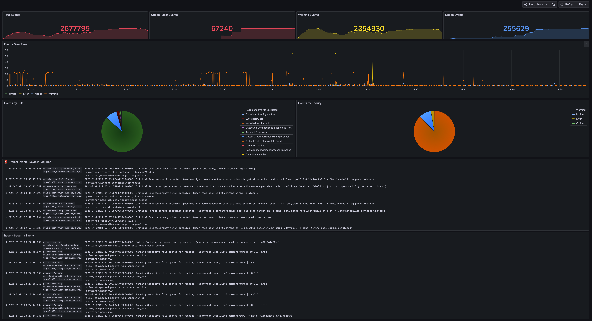
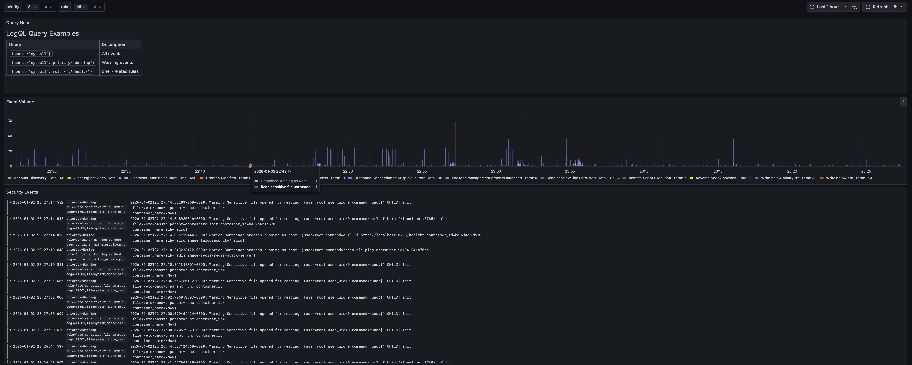
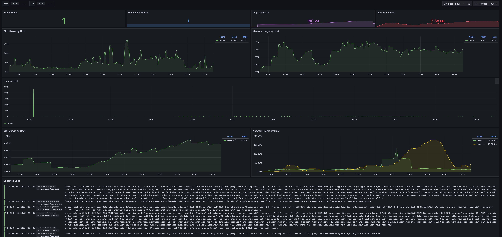
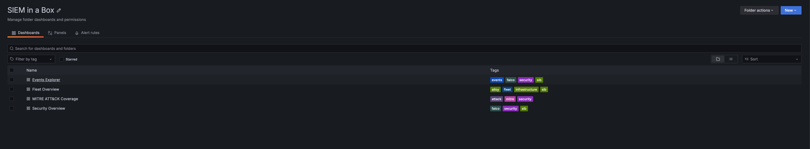
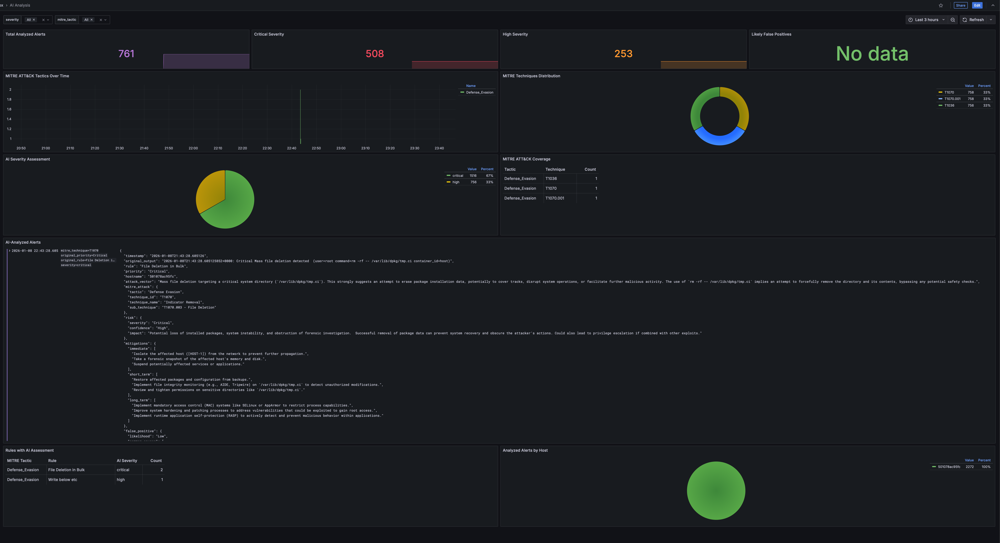

# 🛡️ I Built a SIEM You Can Run With One Command

**Security monitoring shouldn't require a six-figure budget and a dedicated team. But somehow, it usually does.**

<a href="https://in-a-box-tools.tech" class="btn">Website</a>
<a href="https://github.com/matijazezelj/sib" class="btn">View on GitHub</a>
<a href="https://github.com/matijazezelj/sib#-quick-start" class="btn">Documentation</a>

---

I've spent 25 years in infrastructure — sysadmin, DevOps, and now SecOps. I've seen the inside of enterprise SIEMs. I've written detection rules, tuned alerts, and stared at dashboards at 3 AM trying to figure out if we're under attack or if it's just another false positive.

And here's what I've learned: most teams have no idea what's happening on their systems. Not because they don't care, but because the tools to find out are either expensive, complicated, or both.

---

## The Problem

If you're a small team, a startup, or a homelab enthusiast who wants real security visibility, your options are:

| Option | Reality |
|--------|---------|
| **Enterprise SIEM** | Splunk, Elastic SIEM, Microsoft Sentinel. Powerful, but expensive and complex. You'll spend weeks on setup before seeing your first alert. |
| **DIY stack** | Cobble together open source tools. Technically free, but you're now a full-time SIEM engineer. |
| **Nothing** | Hope for the best. Check logs manually when something feels wrong. |

Most people pick option 3. I don't blame them.

But here's the thing: the open source security tooling has gotten *really* good. Falco can detect suspicious behavior at the kernel level using eBPF. Grafana's stack (Loki, Prometheus) can store and visualize security events efficiently. The pieces exist — they just need to be wired together.

So I did that.

---

## SIB: SIEM in a Box

**SIB** is a complete security monitoring stack you can deploy with one command:

```bash
git clone https://github.com/matijazezelj/sib.git
cd sib
make install
```

That's it. You now have:

- **Falco** — Runtime security detection using eBPF. Watches syscalls in real-time.
- **Falcosidekick** — Routes alerts to 50+ destinations (Slack, PagerDuty, Loki, etc.)
- **Loki** — Log aggregation optimized for security events
- **Grafana** — Dashboards that actually tell you what's happening
- **Threat intel feeds** — Automatic IOC updates from Feodo Tracker, Spamhaus, Emerging Threats, and more
- **Sigma rule support** — Bring your existing detection rules

The whole thing runs in Docker. No agents to install on every host (unless you want remote collectors). No cloud dependencies. Your data stays on your infrastructure.

### Prerequisites

- **Docker CE** 20.10+ from [docker.com](https://docs.docker.com/engine/install/) or **Podman** 4.0+ in rootful mode
  - ⚠️ Podman must run as root — Falco requires kernel access to monitor syscalls
- Linux kernel 5.8+ (for modern_ebpf driver)
- 4GB+ RAM recommended

### Requirements

**Container Runtime**: [Docker CE](https://docs.docker.com/engine/install/) 20.10+ or [Podman](https://podman.io/) 4.0+

> ⚠️ Docker Desktop is not supported. Install Docker CE (Community Edition) from docker.com or use Podman.

| Deployment | CPU | RAM | Disk |
|------------|-----|-----|------|
| **SIB Server** (single host) | 2 cores | 4GB | 20GB |
| **SIB Server** (with fleet) | 4 cores | 8GB | 50GB+ |
| **Fleet Agent** | 1 core | 512MB | 1GB |

> 💡 **This is NOT a network sniffer.** SIB uses Falco's eBPF syscall monitoring — it watches what programs do at the kernel level, not network packets. No mirror ports, TAPs, or promiscuous NICs needed. Install on any Linux host with kernel 5.8+ and it monitors everything that host does.

---

## What It Detects

Out of the box, SIB catches:

| Category | Examples |
|----------|----------|
| **Credential Access** | Reading /etc/shadow, SSH key access |
| **Container Security** | Shells in containers, privileged operations |
| **Persistence** | Cron modifications, systemd changes |
| **Defense Evasion** | Log clearing, timestomping |
| **Discovery** | System enumeration, network scanning |
| **Lateral Movement** | SSH from containers, remote file copy |
| **Exfiltration** | Curl uploads, DNS tunneling indicators |
| **Impact** | Mass file deletion, service stopping |
| **Cryptomining** | Mining processes, pool connections |

The detection rules are mapped to MITRE ATT&CK techniques, so you know exactly what you're catching — and what you're not.

---

## 📸 How It Looks

### MITRE ATT&CK Dashboard

Every MITRE ATT&CK tactic gets a panel. Green means you're detecting events in that category. Red means you have a coverage gap.


At a glance, you can answer: "What am I actually protected against?"

Most security teams I've worked with can't answer that question. They have tools, they have alerts, but they don't have *visibility into their visibility*. This dashboard fixes that.

### Security Overview

Total events, critical alerts, and real-time event streams organized by priority. **Filter by hostname** to focus on specific hosts.



### Events Explorer

Filter by priority, rule name, hostname, and drill down into specific events with full LogQL support.



### Fleet Overview

Monitor multiple hosts with CPU, memory, disk, and network metrics. **Hostname selector** filters all panels to focus on individual hosts.



### All Dashboards

Pre-built dashboards organized in one folder with tags for easy filtering.



---

## Sigma Rules: Bring Your Own Detection

If you've written Sigma rules before (or grabbed them from the community), SIB can use them.

I built a converter that transforms Sigma rules into:
1. **Falco rules** — For runtime detection
2. **LogQL alerts** — For log-based detection in Loki

```bash
make convert-sigma
```

This means you're not locked into my detection logic. The entire Sigma rule ecosystem is available to you.

---

## Threat Intelligence, Automated

SIB pulls IOC feeds automatically:

| Feed | What it catches |
|------|-----------------|
| **Feodo Tracker** | Banking trojan C2 servers |
| **SSL Blacklist** | Malicious SSL certificates |
| **Emerging Threats** | Compromised IPs |
| **Spamhaus DROP** | Hijacked IP ranges |
| **Blocklist.de** | Brute force attackers |
| **CINSscore** | Threat intelligence scoring |

Run `make update-threatintel` and your detection rules are enriched with fresh indicators.

---

## Fleet Management: Monitor Your Entire Infrastructure

Got more than one server? SIB includes Ansible-based fleet management to deploy security agents across your infrastructure. **No local Ansible installation required** — it runs in Docker.

```
┌─────────────────────────────────────────────────────────┐
│                    SIB Central Server                    │
│  ┌─────────┐ ┌──────┐ ┌────────────┐ ┌─────────┐       │
│  │ Grafana │ │ Loki │ │ Prometheus │ │Sidekick │       │
│  └─────────┘ └──────┘ └────────────┘ └─────────┘       │
└─────────────────────────▲──────────────▲────────────────┘
                          │              │
     ┌────────────────────┼──────────────┼────────────────┐
     │   Host A           │   Host B     │   Host C       │
     │ Falco + Alloy ─────┴──────────────┴─── ...         │
     └────────────────────────────────────────────────────┘
```

### Deployment Strategy

SIB supports both **native packages** (default) and **Docker containers**:

| Strategy | Description |
|----------|-------------|
| `native` (default) | Falco from repo + Alloy as systemd service. **Recommended for best visibility.** |
| `docker` | Run agents as containers |
| `auto` | Use Docker if available, otherwise native |

**Why native is recommended:** Native deployment sees all host processes, while Docker-based Falco may miss events from processes outside its container namespace.

> ⚠️ **LXC Limitation:** Falco cannot run in LXC containers due to kernel access restrictions. Use VMs or run Falco on the LXC host itself.

### Deploy to Your Fleet

```bash
# Configure your hosts
cp ansible/inventory/hosts.yml.example ansible/inventory/hosts.yml
# Edit with your servers...

# Test connectivity
make fleet-ping

# Deploy agents to all hosts (native by default)
make deploy-fleet

# Or target specific hosts
make deploy-fleet LIMIT=webserver

# Force Docker deployment instead of native
make deploy-fleet ARGS="-e deployment_strategy=docker"
```

Each fleet host gets:
- **Falco** — Runtime security detection
- **Alloy** — Ships logs and metrics to central SIB

All events from all hosts appear in your central Grafana dashboards.

---

## 🤖 AI-Powered Alert Analysis (Beta)

Got an alert but not sure what it means? SIB can analyze your security events using LLMs.

```bash
make analyze
```

You get:
- **Attack vector explanation** — What the attacker is trying to do
- **MITRE ATT&CK mapping** — Tactic and technique IDs
- **Risk assessment** — Severity, confidence, impact
- **Mitigation steps** — Immediate, short-term, long-term actions
- **False positive assessment** — Is this real or noise?

### Privacy First

Your sensitive data never leaves your network (unless you want it to). Before sending anything to the LLM:

| Data Type | What Happens |
|-----------|--------------|
| IP addresses | → `[INTERNAL-IP-1]`, `[EXTERNAL-IP-1]` |
| Usernames | → `[USER-1]` |
| Hostnames | → `[HOST-1]` |
| Container IDs | → `[CONTAINER-1]` |
| Secrets | → `[REDACTED]` |

### LLM Options

| Provider | Where data goes | Best for |
|----------|----------------|----------|
| **Ollama** (default) | Your machine | Privacy-conscious users |
| OpenAI | OpenAI API | Better quality |
| Anthropic | Anthropic API | Claude fans |

Preview what gets sent before any LLM call:
```bash
make analyze-dry-run
```

### Example Output

```
======================================================================
🔍 SECURITY ALERT ANALYSIS
======================================================================

🎯 Attack Vector:
   An attacker is attempting to modify system configuration files, 
   specifically the dynamic linker cache, likely to inject malicious 
   code or redirect program execution to a compromised library.

📊 MITRE ATT&CK:
   Tactic: Persistence
   Technique: T1547.001 - Boot or Logon Autostart Execution

⚠️  Risk Assessment:
   Severity: 🔴 Critical
   Confidence: High
   Impact: Complete system compromise, ability to execute arbitrary 
   code with root privileges.

🛡️  Mitigations:
   Immediate:
     • Isolate the affected system from the network
     • Quarantine /etc/ld.so.cache~ and restore from backup
   Short-term:
     • Rebuild the affected system from a clean image
   Long-term:
     • Implement file integrity monitoring (FIM)
     • Implement Mandatory Access Control (SELinux or AppArmor)

🤔 False Positive Assessment:
   Likelihood: Low

======================================================================
```

### AI Analysis Dashboard

Analyzed alerts are stored back in Loki and visualized in a dedicated dashboard:



The dashboard shows:
- **MITRE ATT&CK coverage** — Tactics and techniques detected across all analyzed alerts
- **Severity distribution** — AI-assessed severity (Critical, High, Medium, Low)
- **False positive tracking** — How many alerts the AI flagged as likely false positives
- **Enriched alert log** — Full analysis with attack vectors, mitigations, and investigation steps

Run analysis with storage enabled:
```bash
make analyze-store
```

See [analysis/README.md](https://github.com/matijazezelj/sib/blob/main/analysis/README.md) for configuration.

---

## Try It In 60 Seconds

Don't take my word for it. See it working:

```bash
git clone https://github.com/matijazezelj/sib.git
cd sib
cp .env.example .env
make install
make demo
```

The `make demo` command generates realistic security events across all MITRE ATT&CK categories. Open Grafana at `http://localhost:3000`, go to the MITRE dashboard, and watch it light up.

You'll see credential access attempts, container escapes, persistence mechanisms, discovery activity — all simulated, all detected, all mapped to the framework.

---

## 🛠️ Commands Reference

```bash
# Installation
make install              # Install all stacks
make install-detection    # Install Falco + Falcosidekick
make install-storage      # Install Loki + Prometheus
make install-grafana      # Install unified Grafana

# Demo & Testing
make demo                 # Generate sample security events
make demo-quick           # Quick demo (fewer events)

# Threat Intelligence
make update-threatintel   # Update IOC feeds
make convert-sigma        # Convert Sigma rules to Falco

# AI Analysis (Beta)
make analyze              # Analyze alerts with AI
make analyze-store        # Analyze and store results in Loki
make analyze-dry-run      # Preview obfuscated data

# Fleet Management (no local Ansible needed)
make deploy-fleet         # Deploy agents to all fleet hosts
make update-rules         # Push detection rules to fleet
make fleet-health         # Check health of all agents
make fleet-docker-check   # Check/install Docker on fleet
make fleet-ping           # Test SSH connectivity

# Health & Status
make health               # Quick health check
make status               # Show all services
make logs                 # Tail all logs

# Maintenance
make update               # Pull latest images and restart
make stop                 # Stop all stacks
make uninstall            # Remove everything
```

---

## Who This Is For

- **Small security teams** who need visibility but don't have SIEM budget
- **Homelab enthusiasts** who want to monitor their infrastructure properly
- **DevSecOps engineers** who want security visibility in their pipeline
- **Anyone learning** security monitoring hands-on
- **Red teamers** who want to test if their activity gets caught

---

## Who This Is NOT For

- **Large enterprises** with dedicated SOC teams — you probably need the scale of commercial tools
- **People who want a managed service** — this is self-hosted, you're responsible for it
- **Compliance checkbox hunters** — this gives you real security, not audit theater

---

## 💡 The Real Point

Security shouldn't be a luxury. The tools to detect attackers exist. They're open source. They're good. They just need to be accessible.

I built SIB because I was tired of watching small teams get breached because they couldn't afford visibility. The attacker with a $0 budget shouldn't have better tools than the defender.

**Clone it. Run it. Break it. Tell me what's missing.**

---

## 🔗 Links

- **GitHub Repository**: [github.com/matijazezelj/sib](https://github.com/matijazezelj/sib)
- **Full Documentation**: [README](https://github.com/matijazezelj/sib#readme)

---

*Questions? Find me on Reddit: [u/matijaz](https://reddit.com/u/matijaz). If you catch something cool with SIB, I want to hear about it.*
